# 📊 Sơ Đồ Phân Tích & Thiết Kế Hệ Thống PHIHub

> Tài liệu này trình bày các sơ đồ UML 2.5 cho hệ thống PHIHub - Personal Health Intelligence Hub

---

## 📋 Mục Lục

1. [Sơ đồ Use Case (Use Case Diagram)](#1-sơ-đồ-use-case-use-case-diagram)
2. [Sơ đồ Thực thể kết hợp (ERD)](#2-sơ-đồ-thực-thể-kết-hợp-erd)
3. [Sơ đồ Tuần tự (Sequence Diagram)](#3-sơ-đồ-tuần-tự-sequence-diagram)
4. [Sơ đồ Hoạt động (Activity Diagram)](#4-sơ-đồ-hoạt-động-activity-diagram)
5. [Sơ đồ Lớp (Class Diagram)](#5-sơ-đồ-lớp-class-diagram)
6. [Sơ đồ Kiến trúc MERN Stack](#6-sơ-đồ-kiến-trúc-mern-stack)
7. [Sơ đồ Triển khai Docker (Deployment Diagram)](#7-sơ-đồ-triển-khai-docker-deployment-diagram)

---

## 1. Sơ đồ Use Case (Use Case Diagram)

### 1.1 Sơ đồ Use Case Tổng Quát

```plantuml
@startuml PHIHub_UseCase_General
left to right direction
skinparam packageStyle rectangle
skinparam actorStyle awesome

actor "Người dùng\n(User)" as User
actor "Quản trị viên\n(Admin)" as Admin

rectangle "Hệ thống PHIHub" {
    ' Authentication
    package "Xác thực" {
        usecase "Đăng ký tài khoản" as UC1
        usecase "Đăng nhập" as UC2
        usecase "Đăng xuất" as UC3
        usecase "Quên mật khẩu" as UC4
    }
    
    ' Profile Management
    package "Quản lý Hồ sơ" {
        usecase "Xem hồ sơ cá nhân" as UC5
        usecase "Cập nhật thông tin cơ bản" as UC6
        usecase "Cập nhật thông tin y tế" as UC7
        usecase "Thay đổi avatar" as UC8
    }
    
    ' Health Metrics
    package "Quản lý Chỉ số Sức khỏe" {
        usecase "Nhập chỉ số sức khỏe" as UC9
        usecase "Xem lịch sử chỉ số" as UC10
        usecase "Xem biểu đồ thống kê" as UC11
        usecase "Xuất dữ liệu CSV" as UC12
    }
    
    ' Goals
    package "Quản lý Mục tiêu" {
        usecase "Tạo mục tiêu mới" as UC13
        usecase "Theo dõi tiến độ" as UC14
        usecase "Cập nhật mục tiêu" as UC15
        usecase "Xóa mục tiêu" as UC16
    }
    
    ' Nutrition
    package "Theo dõi Dinh dưỡng" {
        usecase "Ghi nhật ký bữa ăn" as UC17
        usecase "Xem thống kê dinh dưỡng" as UC18
        usecase "Tính toán macros" as UC19
    }
    
    ' Mood
    package "Nhật ký Tâm trạng" {
        usecase "Ghi nhật ký tâm trạng" as UC20
        usecase "Xem xu hướng tâm trạng" as UC21
    }
    
    ' Knowledge
    package "Góc Kiến thức" {
        usecase "Xem danh sách bài viết" as UC22
        usecase "Đọc chi tiết bài viết" as UC23
        usecase "Tìm kiếm bài viết" as UC24
    }
    
    ' Recommendations
    package "Tư vấn Thông minh" {
        usecase "Nhận khuyến nghị sức khỏe" as UC25
        usecase "Xem cảnh báo sức khỏe" as UC26
    }
    
    ' Reminders
    package "Nhắc nhở" {
        usecase "Tạo nhắc nhở" as UC27
        usecase "Quản lý nhắc nhở" as UC28
    }
    
    ' Admin Functions
    package "Quản trị Hệ thống" {
        usecase "Quản lý bài viết" as UC29
        usecase "Quản lý người dùng" as UC30
        usecase "Xem thống kê hệ thống" as UC31
    }
}

' User relationships
User --> UC1
User --> UC2
User --> UC3
User --> UC4
User --> UC5
User --> UC6
User --> UC7
User --> UC8
User --> UC9
User --> UC10
User --> UC11
User --> UC12
User --> UC13
User --> UC14
User --> UC15
User --> UC16
User --> UC17
User --> UC18
User --> UC19
User --> UC20
User --> UC21
User --> UC22
User --> UC23
User --> UC24
User --> UC25
User --> UC26
User --> UC27
User --> UC28

' Admin relationships (inherits User functions)
Admin --|> User
Admin --> UC29
Admin --> UC30
Admin --> UC31

' Include/Extend relationships
UC9 ..> UC25 : <<include>>
UC9 ..> UC26 : <<include>>
UC11 <.. UC10 : <<extend>>

@enduml
```

### 1.2 Sơ đồ Use Case Chi Tiết - Quản lý Chỉ số Sức khỏe

```plantuml
@startuml PHIHub_UseCase_HealthMetrics
left to right direction
skinparam packageStyle rectangle

actor "Người dùng" as User

rectangle "Quản lý Chỉ số Sức khỏe" {
    usecase "Nhập chỉ số sức khỏe" as UC1
    usecase "Nhập cân nặng" as UC1_1
    usecase "Nhập huyết áp" as UC1_2
    usecase "Nhập nhịp tim" as UC1_3
    usecase "Nhập giấc ngủ" as UC1_4
    usecase "Nhập bước chân" as UC1_5
    usecase "Nhập đường huyết" as UC1_6
    usecase "Nhập lượng nước" as UC1_7
    usecase "Nhập thời gian tập luyện" as UC1_8
    
    usecase "Xem lịch sử chỉ số" as UC2
    usecase "Lọc theo loại chỉ số" as UC2_1
    usecase "Lọc theo khoảng thời gian" as UC2_2
    usecase "Xem dạng bảng" as UC2_3
    usecase "Xem dạng biểu đồ" as UC2_4
    
    usecase "Xuất dữ liệu" as UC3
    usecase "Xuất CSV" as UC3_1
    
    usecase "Xóa chỉ số" as UC4
    
    usecase "Tính toán BMI tự động" as UC5
    usecase "Phân tích xu hướng" as UC6
    usecase "Tạo cảnh báo tự động" as UC7
}

User --> UC1
User --> UC2
User --> UC3
User --> UC4

' Generalization (Nhập chỉ số)
UC1_1 --|> UC1
UC1_2 --|> UC1
UC1_3 --|> UC1
UC1_4 --|> UC1
UC1_5 --|> UC1
UC1_6 --|> UC1
UC1_7 --|> UC1
UC1_8 --|> UC1

' Include relationships
UC1 ..> UC5 : <<include>>
UC2 ..> UC6 : <<include>>
UC1 ..> UC7 : <<include>>

' Extend relationships
UC2_1 <.. UC2 : <<extend>>
UC2_2 <.. UC2 : <<extend>>
UC2_3 <.. UC2 : <<extend>>
UC2_4 <.. UC2 : <<extend>>
UC3_1 <.. UC3 : <<extend>>

@enduml
```

---

## 2. Sơ đồ Thực thể kết hợp (ERD)

### 2.1 ERD - Entity Relationship Diagram (MongoDB Collections)

```plantuml
@startuml PHIHub_ERD
skinparam linetype ortho

entity "users" as Users {
    * _id : ObjectId <<PK>>
    --
    * name : String
    * email : String <<unique>>
    * password : String (hashed)
    dob : Date
    gender : String
    avatar : String
    phone : String
    address : String
    --
    medicalInfo : Object
    ├── height : Number
    ├── bloodType : String
    ├── chronicConditions : Array
    ├── allergies : Array
    ├── medications : Array
    ├── emergencyContact : Object
    └── doctor : Object
    --
    createdAt : Date
    updatedAt : Date
}

entity "health_metrics" as HealthMetrics {
    * _id : ObjectId <<PK>>
    --
    * userId : ObjectId <<FK>>
    * metricType : String
    * value : Number
    * unit : String
    timestamp : Date
    notes : String
    metadata : Map
    --
    createdAt : Date
    updatedAt : Date
}

entity "goals" as Goals {
    * _id : ObjectId <<PK>>
    --
    * userId : ObjectId <<FK>>
    * title : String
    description : String
    * goalType : String
    * targetValue : Number
    startValue : Number
    currentValue : Number
    * unit : String
    startDate : Date
    * targetDate : Date
    status : String
    progress : Number
    milestones : Array
    --
    createdAt : Date
    updatedAt : Date
}

entity "articles" as Articles {
    * _id : ObjectId <<PK>>
    --
    * title : String
    * content : String
    * category : String
    excerpt : String
    imageUrl : String
    source : String
    publishedAt : Date
    views : Number
    --
    createdAt : Date
    updatedAt : Date
}

entity "nutrition_logs" as NutritionLogs {
    * _id : ObjectId <<PK>>
    --
    * userId : ObjectId <<FK>>
    * date : Date
    * mealType : String
    foodItems : Array
    ├── name : String
    ├── quantity : Number
    ├── unit : String
    ├── calories : Number
    └── macros : Object
    totalCalories : Number
    totalProtein : Number
    totalCarbs : Number
    totalFat : Number
    notes : String
    --
    createdAt : Date
    updatedAt : Date
}

entity "mood_logs" as MoodLogs {
    * _id : ObjectId <<PK>>
    --
    * userId : ObjectId <<FK>>
    * date : Date
    * mood : String
    * moodScore : Number
    energy : String
    energyScore : Number
    stress : String
    stressScore : Number
    anxiety : Number
    activities : Array
    emotions : Array
    journal : String
    gratitude : Array
    --
    createdAt : Date
    updatedAt : Date
}

entity "reminders" as Reminders {
    * _id : ObjectId <<PK>>
    --
    * userId : ObjectId <<FK>>
    * title : String
    * message : String
    * type : String
    * frequency : String
    * time : String
    days : Array
    startDate : Date
    endDate : Date
    enabled : Boolean
    lastTriggered : Date
    nextTrigger : Date
    --
    createdAt : Date
    updatedAt : Date
}

entity "alerts" as Alerts {
    * _id : ObjectId <<PK>>
    --
    * userId : ObjectId <<FK>>
    * type : String
    * category : String
    * title : String
    * message : String
    * severity : String
    metricType : String
    metricValue : Number
    threshold : Object
    isRead : Boolean
    isResolved : Boolean
    resolvedAt : Date
    --
    createdAt : Date
    updatedAt : Date
}

' Relationships
Users ||--o{ HealthMetrics : "1:N"
Users ||--o{ Goals : "1:N"
Users ||--o{ NutritionLogs : "1:N"
Users ||--o{ MoodLogs : "1:N"
Users ||--o{ Reminders : "1:N"
Users ||--o{ Alerts : "1:N"

note right of HealthMetrics
    metricType:
    - weight, height, bmi
    - bloodPressure, heartRate
    - sleep, sleepQuality
    - steps, exercise, calories
    - water, bloodSugar
end note

note right of Goals
    status:
    - active
    - completed
    - failed
    - cancelled
end note

note right of NutritionLogs
    mealType:
    - breakfast
    - lunch
    - dinner
    - snack
end note

@enduml
```

---

## 3. Sơ đồ Tuần tự (Sequence Diagram)

### 3.1 Luồng Đăng nhập (Login Flow)

```plantuml
@startuml PHIHub_Sequence_Login
skinparam sequenceMessageAlign center
skinparam responseMessageBelowArrow true

actor "Người dùng" as User
participant "React\nFrontend" as React
participant "Express\nBackend" as Express
database "MongoDB" as DB

User -> React : Nhập email & password
activate React

React -> Express : POST /api/auth/login\n{email, password}
activate Express

Express -> DB : findOne({email})
activate DB
DB --> Express : User document
deactivate DB

alt Không tìm thấy user
    Express --> React : 401 Unauthorized\n"Email không tồn tại"
    React --> User : Hiển thị lỗi
else Tìm thấy user
    Express -> Express : bcrypt.compare(password, hash)
    
    alt Mật khẩu sai
        Express --> React : 401 Unauthorized\n"Mật khẩu không đúng"
        React --> User : Hiển thị lỗi
    else Mật khẩu đúng
        Express -> Express : Tạo JWT token
        Express --> React : 200 OK\nSet-Cookie: token (HttpOnly)\n{user data}
        React -> React : Lưu user vào AuthContext
        React --> User : Chuyển đến Dashboard
    end
end

deactivate Express
deactivate React

@enduml
```

### 3.2 Luồng Nhập Chỉ số Cân nặng và Nhận Tư vấn

```plantuml
@startuml PHIHub_Sequence_Weight
skinparam sequenceMessageAlign center

actor "Người dùng" as User
participant "React\nFrontend" as React
participant "Express\nBackend" as Express
participant "Recommendation\nService" as RecService
database "MongoDB" as DB

User -> React : Nhập cân nặng (70 kg)
activate React

React -> Express : POST /api/metrics\n{metricType: "weight", value: 70, unit: "kg"}
activate Express

Express -> Express : Xác thực JWT token

Express -> DB : Lấy chiều cao từ User
activate DB
DB --> Express : height = 170 cm
deactivate DB

Express -> Express : Tính BMI = 70 / (1.7^2) = 24.2

Express -> DB : Lưu weight metric
activate DB
DB --> Express : OK
deactivate DB

Express -> DB : Lưu BMI metric (tự động)
activate DB
DB --> Express : OK
deactivate DB

Express -> RecService : generateRecommendations(userId)
activate RecService

RecService -> DB : Lấy metrics 7 ngày gần nhất
activate DB
DB --> RecService : [weight, bmi, sleep, ...]
deactivate DB

RecService -> RecService : Chạy json-rules-engine\n(15 health rules)

alt BMI >= 25 (Thừa cân)
    RecService -> DB : Tạo Alert (warning)\n"Chỉ số BMI cao"
    RecService -> RecService : Tạo recommendation\n"Nên tăng cường vận động"
else BMI < 18.5 (Thiếu cân)
    RecService -> DB : Tạo Alert (warning)\n"Chỉ số BMI thấp"
    RecService -> RecService : Tạo recommendation\n"Nên bổ sung dinh dưỡng"
else BMI bình thường
    RecService -> RecService : Tạo recommendation\n"Duy trì lối sống lành mạnh"
end

RecService --> Express : recommendations[]
deactivate RecService

Express --> React : 201 Created\n{metric, bmi, recommendations}
deactivate Express

React -> React : Cập nhật Dashboard\nHiển thị biểu đồ mới

React --> User : Hiển thị kết quả\n+ Khuyến nghị sức khỏe

deactivate React

@enduml
```

### 3.3 Luồng Xem Biểu đồ Thống kê

```plantuml
@startuml PHIHub_Sequence_Chart
skinparam sequenceMessageAlign center

actor "Người dùng" as User
participant "React\nFrontend" as React
participant "Express\nBackend" as Express
database "MongoDB" as DB

User -> React : Truy cập Dashboard
activate React

React -> Express : GET /api/metrics?metricType=weight&days=30
activate Express

Express -> Express : Xác thực JWT token

Express -> DB : aggregate([\n  {$match: {userId, metricType, timestamp >= 30d}},\n  {$sort: {timestamp: 1}}\n])
activate DB
DB --> Express : [30 weight records]
deactivate DB

Express --> React : 200 OK\n{data: [...], stats: {avg, min, max}}
deactivate Express

React -> React : Recharts render\nLineChart với data

React --> User : Hiển thị biểu đồ\ncân nặng 30 ngày

deactivate React

@enduml
```

---

## 4. Sơ đồ Hoạt động (Activity Diagram)

### 4.1 Quy trình Đưa ra Tư vấn Tự động (Recommendation Engine)

```plantuml
@startuml PHIHub_Activity_Recommendation
start

:Nhận dữ liệu chỉ số sức khỏe mới;

:Lấy metrics 7 ngày gần nhất từ DB;

fork
    :Phân tích BMI;
    if (BMI >= 30?) then (yes)
        :Tạo Alert "Béo phì"\n(severity: high);
        :Khuyến nghị: Giảm cân,\ntập luyện, tư vấn bác sĩ;
    elseif (BMI >= 25?) then (yes)
        :Tạo Alert "Thừa cân"\n(severity: medium);
        :Khuyến nghị: Tăng cường\nvận động, ăn uống lành mạnh;
    elseif (BMI < 18.5?) then (yes)
        :Tạo Alert "Thiếu cân"\n(severity: medium);
        :Khuyến nghị: Bổ sung\ndinh dưỡng;
    else (18.5 <= BMI < 25)
        :BMI bình thường;
        :Khuyến nghị: Duy trì\nlối sống hiện tại;
    endif
fork again
    :Phân tích Huyết áp;
    if (Systolic > 140 OR Diastolic > 90?) then (yes)
        :Tạo Alert "Huyết áp cao"\n(severity: high);
        :Khuyến nghị: Giảm muối,\ntập thể dục, khám bác sĩ;
    elseif (Systolic < 90 OR Diastolic < 60?) then (yes)
        :Tạo Alert "Huyết áp thấp"\n(severity: medium);
        :Khuyến nghị: Uống đủ nước,\nđứng dậy từ từ;
    else (Bình thường)
        :Huyết áp ổn định;
    endif
fork again
    :Phân tích Giấc ngủ;
    if (Avg sleep < 6h?) then (yes)
        :Tạo Alert "Thiếu ngủ"\n(severity: medium);
        :Khuyến nghị: Ngủ sớm hơn,\ngiảm caffeine, giảm screen time;
    elseif (Avg sleep > 9h?) then (yes)
        :Tạo Alert "Ngủ quá nhiều"\n(severity: low);
        :Khuyến nghị: Kiểm tra\nsức khỏe;
    else (6-9h)
        :Giấc ngủ tốt;
    endif
fork again
    :Phân tích Bước chân;
    if (Avg steps < 5000?) then (yes)
        :Tạo Alert "Ít vận động"\n(severity: medium);
        :Khuyến nghị: Đi bộ thêm,\ndùng cầu thang bộ;
    else (>= 5000)
        :Hoạt động đủ;
    endif
fork again
    :Phân tích Đường huyết;
    if (Blood sugar > 126?) then (yes)
        :Tạo Alert "Đường huyết cao"\n(severity: critical);
        :Khuyến nghị: Khám bác sĩ\nngay, kiểm soát đường;
    elseif (Blood sugar < 70?) then (yes)
        :Tạo Alert "Đường huyết thấp"\n(severity: high);
        :Khuyến nghị: Ăn nhẹ ngay,\nmang theo đường;
    else (70-126)
        :Đường huyết ổn;
    endif
end fork

:Tổng hợp danh sách recommendations;

:Lưu Alerts vào DB;

:Trả về recommendations cho Frontend;

stop

@enduml
```

### 4.2 Quy trình Nhập và Xử lý Chỉ số Sức khỏe

```plantuml
@startuml PHIHub_Activity_MetricEntry
start

:Người dùng chọn loại chỉ số;

switch (Loại chỉ số?)
case (Cân nặng)
    :Nhập giá trị (kg);
case (Huyết áp)
    :Nhập Systolic (mmHg);
    :Nhập Diastolic (mmHg);
case (Nhịp tim)
    :Nhập giá trị (bpm);
case (Giấc ngủ)
    :Nhập số giờ;
case (Bước chân)
    :Nhập số bước;
case (Đường huyết)
    :Nhập giá trị (mg/dL);
case (Nước uống)
    :Nhập lượng (ml/L);
endswitch

:Chọn ngày/giờ ghi nhận;

:Thêm ghi chú (tùy chọn);

:Xác nhận và gửi;

:Frontend validate dữ liệu;

if (Dữ liệu hợp lệ?) then (yes)
    :Gửi request đến Backend;
    
    :Backend xác thực JWT;
    
    if (Token hợp lệ?) then (yes)
        :Lưu metric vào MongoDB;
        
        if (Là cân nặng?) then (yes)
            :Tính BMI tự động;
            :Lưu BMI metric;
        endif
        
        :Chạy Recommendation Engine;
        
        if (Có cảnh báo?) then (yes)
            :Tạo Alert;
            :Thông báo người dùng;
        endif
        
        :Trả về thành công;
        :Cập nhật Dashboard;
        
    else (no)
        :Trả về 401 Unauthorized;
        :Chuyển về trang Login;
    endif
    
else (no)
    :Hiển thị lỗi validation;
endif

stop

@enduml
```

---

## 5. Sơ đồ Lớp (Class Diagram)

### 5.1 Sơ đồ Lớp - Models (MongoDB Schemas)

### 5.2 Sơ đồ Lớp - Controllers & Services

---

## 6. Sơ đồ Kiến trúc MERN Stack

### 6.1 Kiến trúc Tổng quan MERN Stack

### 6.2 Luồng Dữ liệu Chi tiết

### 6.3 Chi tiết API Endpoints

---

## 7. Sơ đồ Triển khai Docker (Deployment Diagram)

### 7.1 Sơ đồ Triển khai Docker Compose

```plantuml
@startuml PHIHub_Docker_Deployment
skinparam backgroundColor #FEFEFE

title Sơ đồ Triển khai Docker - PHIHub

' Define nodes
node "Host Machine\n(Development/Production Server)" as Host {
    
    node "Docker Engine" as DockerEngine {
        
        ' Docker Network
        frame "Docker Network: phihub-network\n(bridge)" as Network {
            
            ' MongoDB Container
            artifact "Container: phihub-mongo" as MongoContainer {
                component [MongoDB 7.0\nAlpine] as MongoDB
                storage "Volume:\nphihub-mongo-data" as MongoVolume
            }
            
            ' Server Container
            artifact "Container: phihub-server" as ServerContainer {
                component [Node.js 18\nAlpine] as NodeJS
                component [Express.js\nApp] as ExpressApp
                folder "Environment Variables" as EnvVars {
                    file "MONGO_URI" as MongoURI
                    file "JWT_SECRET" as JWTSecret
                    file "NODE_ENV" as NodeEnv
                }
            }
            
            ' Client Container
            artifact "Container: phihub-client" as ClientContainer {
                component [Nginx 1.25\nAlpine] as Nginx
                folder "/usr/share/nginx/html" as NginxHtml {
                    file "React Build\n(Static files)" as ReactBuild
                }
            }
        }
    }
    
    ' Port mappings
    interface "Port 27017" as Port27017
    interface "Port 5000" as Port5000
    interface "Port 8080" as Port8080
}

' External access
cloud "Internet\n(Người dùng)" as Internet

' Connections
Internet --> Port8080 : HTTP Request
Port8080 --> Nginx : Forward
Nginx --> ReactBuild : Serve static
Nginx --> Port5000 : Proxy /api/*

Port5000 --> ExpressApp : Forward
ExpressApp --> MongoDB : mongoose\n(port 27017)
MongoDB --> MongoVolume : persist data

NodeJS --> ExpressApp : runs
MongoURI --> ExpressApp : config

' Dependencies
ServerContainer ..> MongoContainer : depends_on\n(healthy)
ClientContainer ..> ServerContainer : depends_on

note right of MongoContainer
    **MongoDB Container**
    Image: mongo:7.0-alpine
    Port: 27017
    Volume: Persistent data
    Healthcheck: mongosh --eval
end note

note right of ServerContainer
    **Server Container**
    Image: node:18-alpine
    Port: 5000
    Build: Multi-stage
    Restart: unless-stopped
end note

note right of ClientContainer
    **Client Container**
    Image: nginx:1.25-alpine
    Port: 8080
    Build: Multi-stage
    (Node build → Nginx serve)
end note

@enduml
```

### 7.2 Chi tiết Docker Compose Configuration

### 7.3 Multi-stage Dockerfile Build Process

### 7.4 Nginx Reverse Proxy Configuration

```plantuml
@startuml PHIHub_Nginx_Config
skinparam backgroundColor #FEFEFE

title Nginx Configuration - PHIHub Client

actor "Người dùng" as User
participant "Browser" as Browser
participant "Nginx\n(phihub-client:80)" as Nginx
participant "Express\n(phihub-server:5000)" as Express
database "MongoDB\n(phihub-mongo:27017)" as MongoDB

== Request trang web (Static files) ==
User -> Browser : Truy cập http://localhost:8080
Browser -> Nginx : GET /
Nginx -> Nginx : Serve index.html\nfrom /usr/share/nginx/html
Nginx --> Browser : HTML + JS + CSS
Browser --> User : Render React App

== API Request (Proxy) ==
User -> Browser : Đăng nhập
Browser -> Nginx : POST /api/auth/login
Nginx -> Nginx : Match location /api/
Nginx -> Express : Proxy pass to\nhttp://phihub-server:5000/api/auth/login
Express -> MongoDB : Query user
MongoDB --> Express : User data
Express --> Nginx : JSON response + Set-Cookie
Nginx --> Browser : Forward response
Browser --> User : Chuyển đến Dashboard

== SPA Routing (try_files) ==
User -> Browser : Truy cập /dashboard
Browser -> Nginx : GET /dashboard
Nginx -> Nginx : try_files $uri /index.html
Nginx --> Browser : index.html
Browser -> Browser : React Router\nhandle /dashboard
Browser --> User : Render DashboardPage

note over Nginx
    **nginx.conf highlights:**
    - listen 80
    - root /usr/share/nginx/html
    - location /api/ { proxy_pass http://phihub-server:5000; }
    - location / { try_files $uri $uri/ /index.html; }
    - gzip compression enabled
end note

@enduml
```

### 7.5 Tổng quan Triển khai Production

---

## 📝 Ghi chú

### Công cụ vẽ sơ đồ
- **PlantUML**: Tất cả sơ đồ trên được viết bằng cú pháp PlantUML
- **Render online**: [plantuml.com](https://www.plantuml.com/plantuml/uml)
- **VS Code Extension**: PlantUML extension để preview

### Cách render sơ đồ
1. Copy nội dung giữa `@startuml` và `@enduml`
2. Paste vào [PlantUML Online Server](https://www.plantuml.com/plantuml/uml)
3. Hoặc sử dụng VS Code với extension PlantUML

### Quy ước ký hiệu

| Ký hiệu | Ý nghĩa |
|---------|---------|
| `*` | Bắt buộc (required) |
| `<<PK>>` | Primary Key |
| `<<FK>>` | Foreign Key |
| `<<include>>` | Use case bao gồm |
| `<<extend>>` | Use case mở rộng |
| `1:N` | Quan hệ một-nhiều |
| `1:1` | Quan hệ một-một |

---

**Tác giả:** Phan Đăng Khoa  
**MSSV:** 110122227  
**Cập nhật lần cuối:** 25/12/2025
